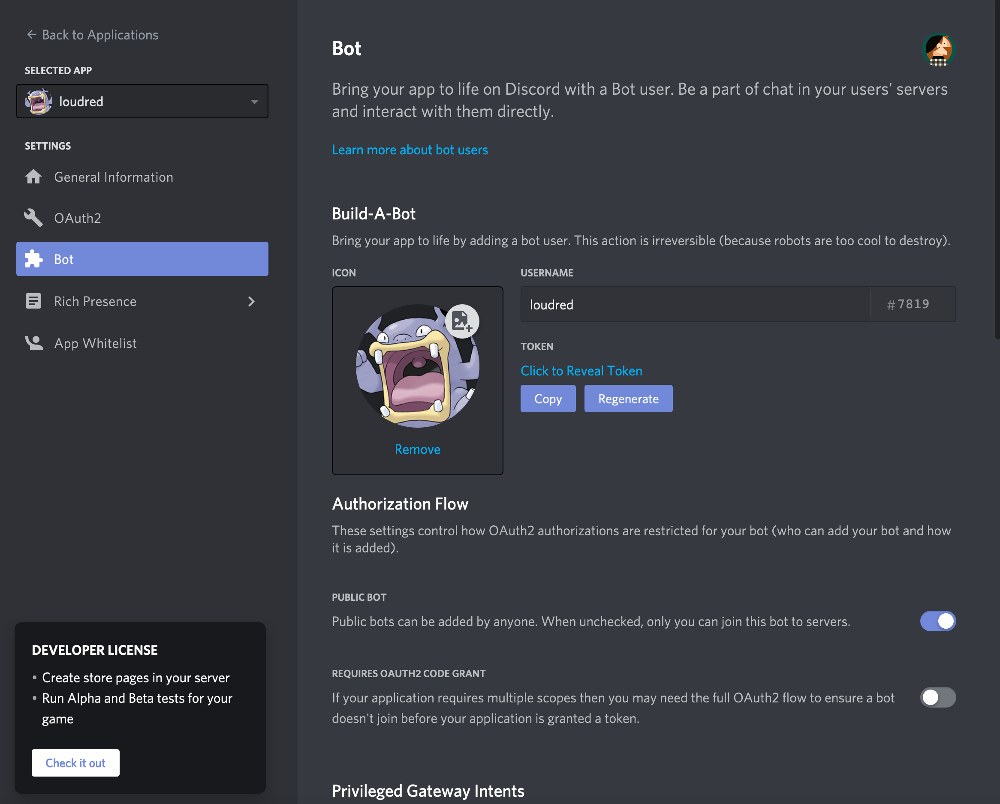
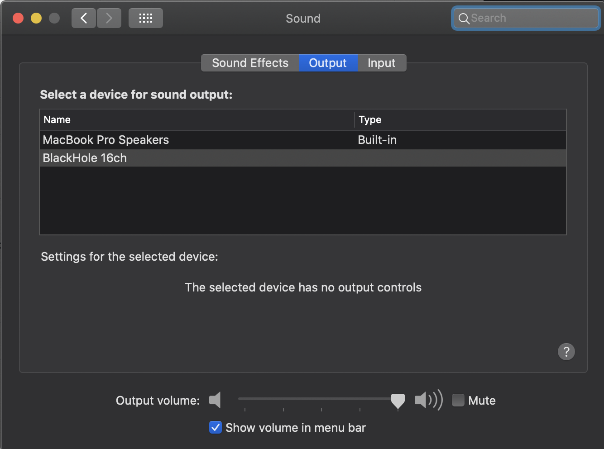
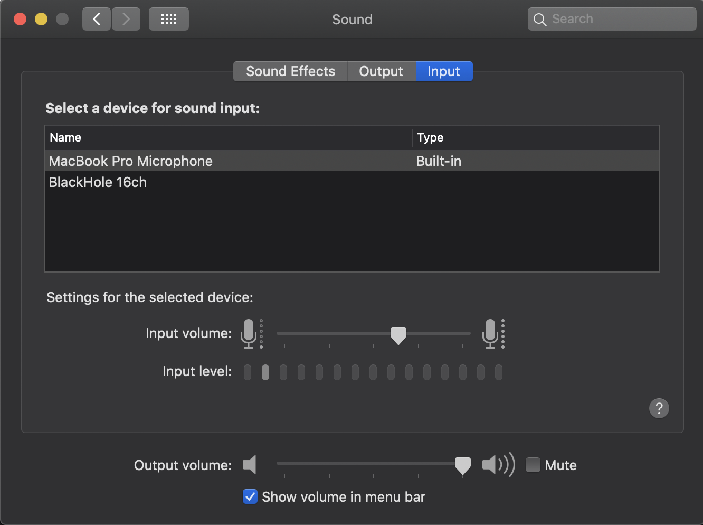
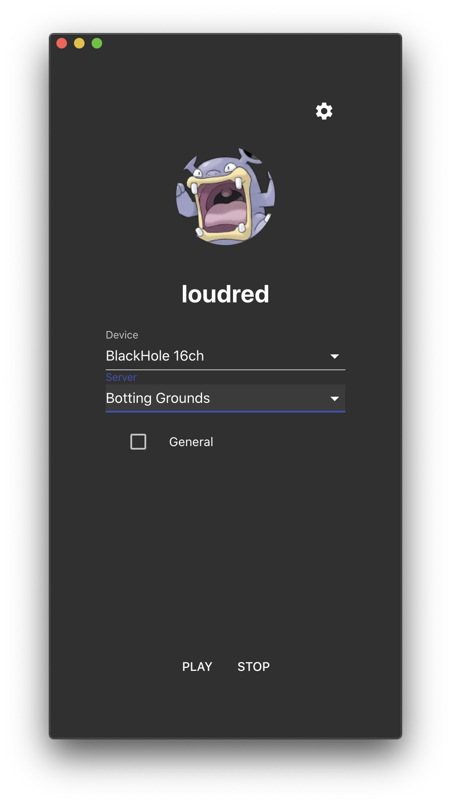
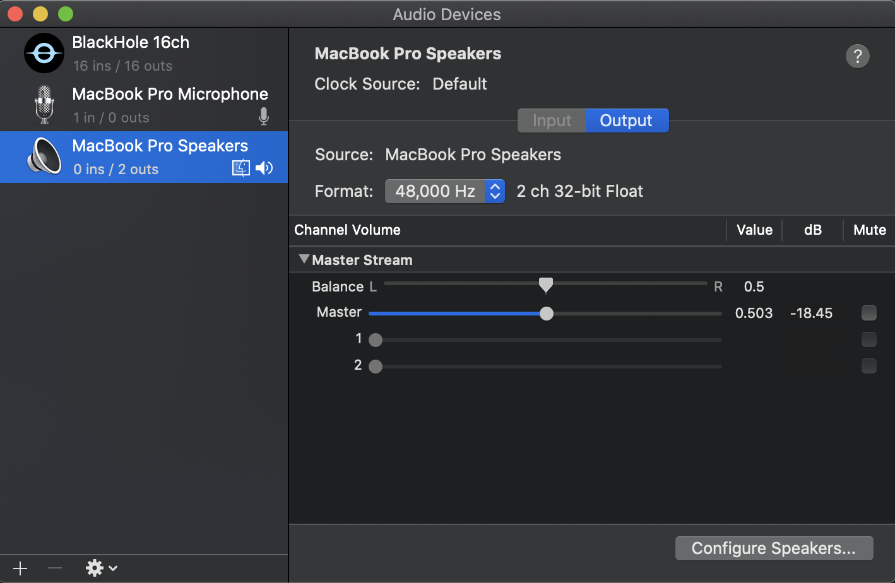
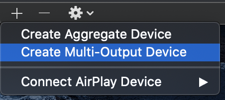
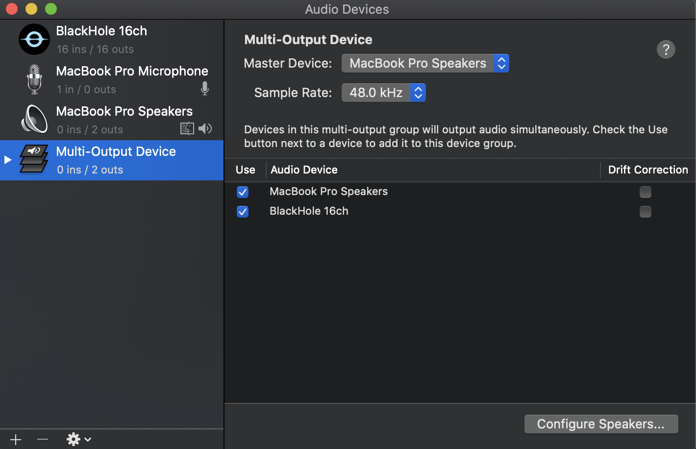
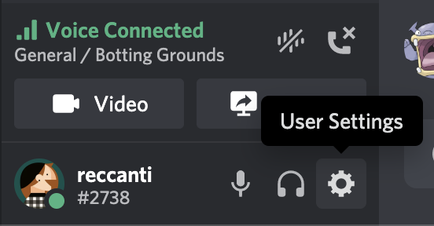
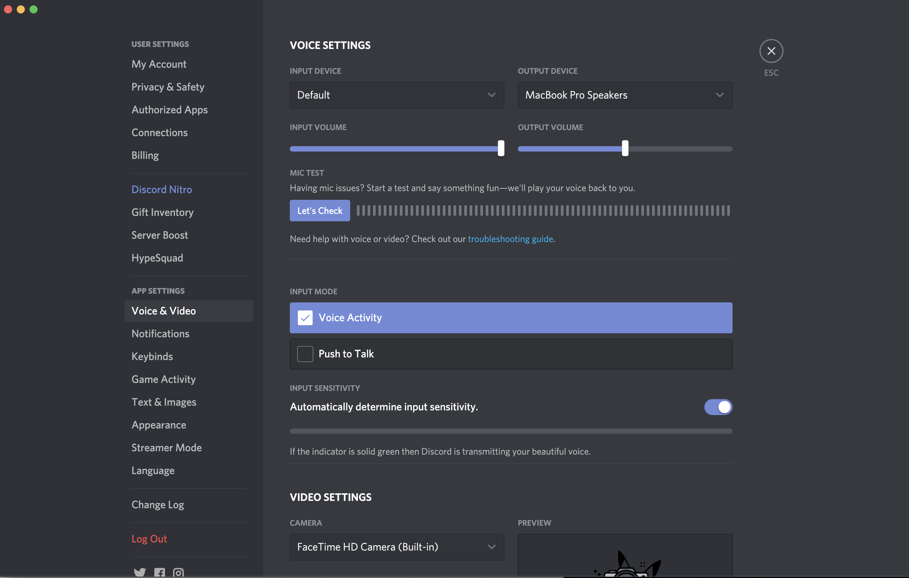

# Loudred - Discord Bot for streaming audio


_A wild Loudred appeared_

> Loudred! Loudred!

Hmm... this Loudred apears to be trying to say something.

> Loudred LOUDRED Loudred!

It seems like they're saying...that they're a Discord Bot that streams audio from a MacOS audio device?

## Motivations

This is quite strange. Wild Loudred don't usually venture out this way. What brought you here, Loudred?

> Loudred Loud!

They're saying that they're here to fix a limitation with [Go Live with Discord](https://support.discord.com/hc/en-us/articles/360040816151-Share-your-screen-with-Go-Live-Screen-Share) on MacOS. Currently, MacOS users are unable to stream audio through this service, but by adding Loudred as a bot, you can stream audio through them instead.

## Setup

> Loud Loud Loudred!

Slow down there, Loudred! They appear to be trying to tell us how to use them to stream audio. It's a little complicated, but I'll do my best to break it down:

### 1. Setup a Discord Bot and add it to your Server

The first thing you need to do is create an application with a bot, and then add it to your server

> Loudred!

Oh, thank you Loudred. They've given us some helpful documentation:

- [Read this to learn how to set up a Discord Bot and application](https://discordjs.guide/preparations/setting-up-a-bot-application.html)
- and [read this to learn how to add your bot to a server](https://discordjs.guide/preparations/adding-your-bot-to-servers.html)

At the end of this process, your bot page should look something like this:



_NOTE: Feel free to name your bot and application something other than Loudred!_

### 2. Configure your audio devices

For this next step, you'll need some way of capturing your computer's sound output in an audio device.

> Loud! Loud!

Loudred recommends using a program called [BlackHole](https://github.com/ExistentialAudio/BlackHole) (a wonderful program that you should consider [sponsoring](https://github.com/sponsors/ExistentialAudio)) for this. It works by creating a virtual audio device that you can read and write audio data to. Don't worry if you don't understand all that, we'll walk you through how to set all this up later! You can install it with homebrew by running the command:

```bash
brew cask install blackhole
```

[Or install it using their intaller](http://existential.audio/blackhole/)

Check out your audio devices by going to `System Preferences > Sound`. You should have the following output devices:



and the following input devices:



### 3. Building the application

> Loudred! Loudred! LOUDRED!

Unfortunately there isn't a prebuilt version of Loudred yet, so you'll need to build it yourself. But don't worry, we'll walk you through the steps!

#### Install dependencies

For this step, you'll need to make sure you have the following dependencies installed:

1. NodeJS - [Download NodeJS here](https://nodejs.org/en/download/)
2. FFmpeg - [Download FFmpeg here](https://ffmpeg.org/download.html) or install it using `brew install ffmpeg`

#### Download the repo from Github

Once you have those dependencies installed, run the following command to download this repo:

```bash
git clone https://github.com/reccanti/Loudred.git
```

#### Build the application

Once that repo's finished downloading, Run the following commands to build the application

```bash
## move into the folder of the repo we just downloaded
cd Loudred

## install all of our JavaScript dependencies
npm install

## Build the Electron app
npm run package
```

You should should now have an application called `loudred-app` you can run in the `packages/mac/` folder.

## Running Loudred

> Loudred! Loudred!

When you run the Loudred application, it should look like this:



Make sure to set your "Device" to `BlackHole` and the "Server" to whatever your Discord Server is. From there, you can select which Voice Channels you'd like to join.

However, you still need to pipe your audio to BlackHole. There are a few ways of doing this depending on your situation.

### 1. Setup your program's audio devices

#### The Easy Way

> Loudred Loud!

If the program you're trying to stream supports changing the Audio output device, that's great! Just set your program's audio device to BlackHole and you're done!

A great example of this is VLC, which lets you set the output device in its Audio menu like so:


#### The Hard Way

> Loud! Loud!

Unfortunately, not every program supports changing the audio device, or makes it readily available. In this case, we'll need to get a little more creative...

The first thing you'll need to do is make a Multi-Output Device. This will direct our audio to multiple sources. We're going to use it to direct audio to both our speakers and BlackHole. Open up the `Audio MIDI Setup` program. Yours should look something like this:



Click the "+" button at the bottom and select `Create Multi-Output Device`:



You should now have a Multi-output device! Make sure both "MacBook Pro Speakers" and "BlackHole 16ch" are selected, and make sure "MacBook Pro Speakers" is the Master Device. It should look something like this:



Then, right click "Multi-Output Device"'s icon and select "Use This Device For Sound Output":


_NOTE: You may not hear any audio if "MacBook Pro Speakers" isn't at the top of your Audio Devices. To fix this, just deselect and reselect "BlackHole 16ch", and that should move it below the speakers_

### 2. Setup Discord's Audio Device

> Loudred! Loudred! Loudred!

We're almost done! Our next step is to set Discord's Output Audio Device. This is much easier. To do this, click the "User Settings" gear at the bottom of the client:



Then, go to `Voice & Video` and set the Output Device to "MacBook Pro Speakers". Or, if you're wearing headphones, set it to those! The important thing is that you DON'T set your output device to anything that's directing audio to BlackHole, since that will produce an echo. Your configuration should look something like this:



### 3. Start Streaming

> Loudred! Loudred! Loud!

And that's it! You should now be able to use Loudred in your Discord Server.

If any of these steps was unclear, please [log an issue](https://github.com/reccanti/Loudred-app/issues/new) so we can make Loudred better!
